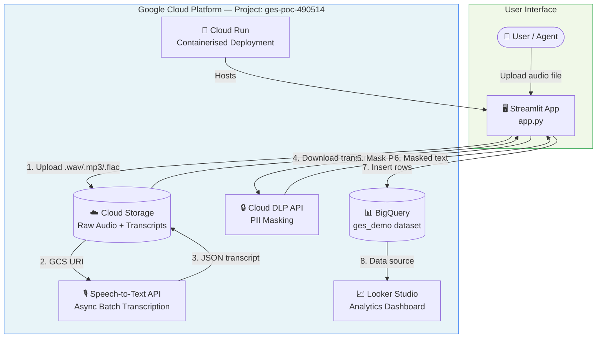
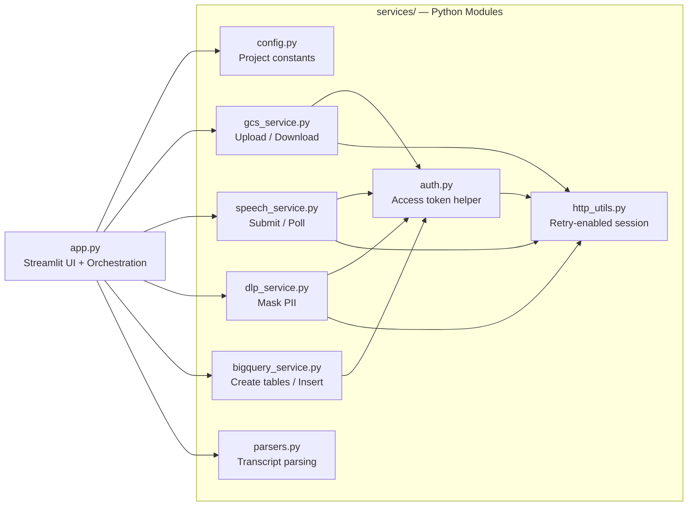
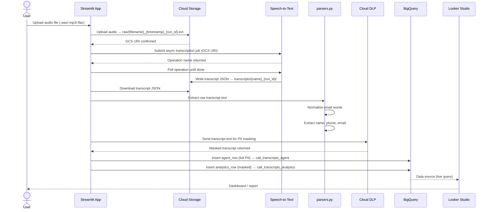
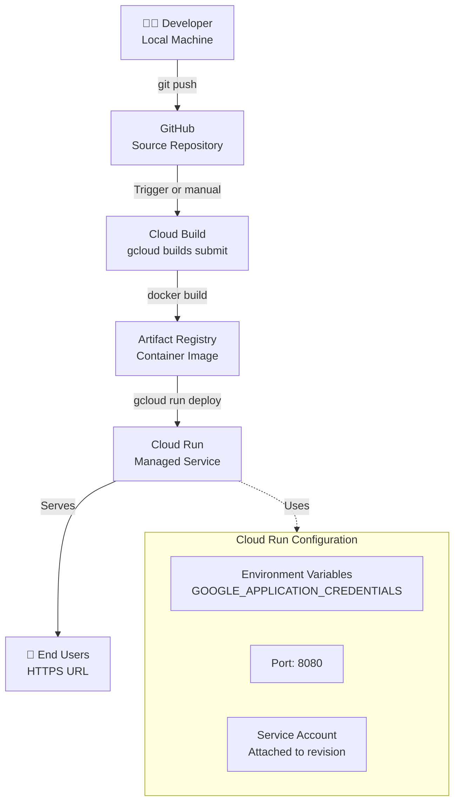

# GES Audio Processing POC — Technical Documentation

> **Project:** GES Audio Processing Proof of Concept  
> **Stack:** Python · Streamlit · Google Cloud Platform  
> **Repository:** [bvaidehi10/ges-poc-app](https://github.com/bvaidehi10/ges-poc-app)  
> **Status:** POC / Active Development

---

## Table of Contents

1. [Executive Summary](#1-executive-summary)
2. [System Architecture](#2-system-architecture)
3. [GCP Services & Responsibilities](#3-gcp-services--responsibilities)
4. [Repository Structure](#4-repository-structure)
5. [Data Flow](#5-data-flow)
6. [Local Setup — macOS](#6-local-setup--macos)
7. [Authentication & Service Account](#7-authentication--service-account)
8. [Running the Application](#8-running-the-application)
9. [Deployment — Cloud Run](#9-deployment--cloud-run)
10. [BigQuery Schema](#10-bigquery-schema)
11. [Looker Studio Connection](#11-looker-studio-connection)
12. [Troubleshooting](#12-troubleshooting)

---

## 1. Executive Summary

The GES Audio Processing POC is a browser-based application that enables end-to-end processing of call-center audio recordings. Users upload a `.wav`, `.mp3`, or `.flac` file through a Streamlit interface; the system then orchestrates a pipeline across seven GCP services to produce privacy-masked transcripts, structured data in BigQuery, and a Looker Studio analytics dashboard.

**Key capabilities:**

- Upload and store call audio in Google Cloud Storage
- Transcribe audio using Google Speech-to-Text (async batch job)
- Extract customer entities: name, phone number, email
- Mask PII using Google Cloud DLP
- Store two data views in BigQuery: a full agent view and a masked analytics view
- Visualise results via Looker Studio connected to BigQuery

---

## 2. System Architecture

### 2.1 High-Level Architecture



### 2.2 Service Interaction Map



---

## 3. GCP Services & Responsibilities

| Service | Role | Key Details |
|---|---|---|
| **Cloud Storage** | Stores raw audio and transcript JSON | Prefixes: `raw/`, `transcripts/` |
| **Speech-to-Text** | Async batch transcription | Polls operation until complete; supports en-US |
| **Cloud DLP** | Masks PII in transcript text | Targets: names, phone numbers, email addresses |
| **BigQuery** | Persistent structured storage | Dataset: `ges_demo`; two tables per call |
| **Looker Studio** | Business analytics dashboard | Connected to `call_transcripts_analytics` table |
| **Cloud Run** | Serverless container hosting | Builds from Docker; auto-scales to zero |

---

## 4. Repository Structure

```
ges-poc-app/
├── app.py                          # Streamlit UI and pipeline orchestration
├── requirements.txt                # Python dependencies
├── PROJECT_WORKFLOW_DOCUMENTATION.md
└── services/
    ├── config.py                   # Project ID, bucket name, table names, constants
    ├── auth.py                     # Google access token helper (ADC / service account)
    ├── http_utils.py               # Retry-enabled HTTP session (urllib3 + requests)
    ├── gcs_service.py              # Cloud Storage: upload, list, download
    ├── speech_service.py           # Speech-to-Text: submit job, poll operation
    ├── dlp_service.py              # DLP: mask sensitive fields in transcript
    ├── bigquery_service.py         # BigQuery: ensure tables exist, insert rows
    └── parsers.py                  # Transcript parsing, email normalisation, entity extraction
```

**Design rationale:** The UI layer (`app.py`) is fully decoupled from cloud integrations. Each GCP service has a dedicated module. Retry/network logic is centralised in `http_utils.py`, making the codebase straightforward to explain, extend, and test independently.

---

## 5. Data Flow



### 5.1 Two BigQuery Views

The pipeline writes two separate rows per processed call, enforcing data access control at the data layer:

| Table | Audience | Contains PII? |
|---|---|---|
| `call_transcripts_agent` | Internal agents / compliance | Yes — name, phone, email, raw transcript |
| `call_transcripts_analytics` | Analysts / reporting | No — DLP-masked transcript only |

---

## 6. Local Setup — macOS

### 6.1 Prerequisites

Ensure the following are installed before proceeding:

| Tool | Version | Install |
|---|---|---|
| Python | ≥ 3.10 | `brew install python` |
| Google Cloud SDK | Latest | [cloud.google.com/sdk](https://cloud.google.com/sdk/docs/install) |
| Git | Any | `brew install git` |

### 6.2 Clone the Repository

```bash
git clone https://github.com/bvaidehi10/ges-poc-app.git
cd ges-poc-app
```

### 6.3 Create and Activate a Virtual Environment

```bash
python3 -m venv .venv
source .venv/bin/activate
```

### 6.4 Install Python Dependencies

```bash
pip install -r requirements.txt
```

Dependencies installed:

```
streamlit>=1.37.0
google-cloud-storage>=2.18.0
google-cloud-bigquery>=3.25.0
google-auth>=2.34.0
requests>=2.32.0
urllib3>=2.2.0
```

---

## 7. Authentication & Service Account

The application authenticates to GCP using **Application Default Credentials (ADC)**. Two authentication paths are supported.

### 7.1 Local Development (gcloud ADC)

```bash
gcloud auth application-default login
gcloud config set project ges-poc-490514
```

This writes credentials to `~/.config/gcloud/application_default_credentials.json`, which the Google client libraries pick up automatically.

### 7.2 Service Account (Recommended for CI / Cloud Run)

**Step 1 — Create a service account in GCP Console:**

```
IAM & Admin → Service Accounts → Create Service Account
```

**Step 2 — Grant the following IAM roles:**

| Role | Purpose |
|---|---|
| `roles/storage.objectAdmin` | Upload/download files in Cloud Storage |
| `roles/speech.client` | Submit Speech-to-Text jobs |
| `roles/dlp.user` | Call DLP inspect/deidentify |
| `roles/bigquery.dataEditor` | Insert rows into BigQuery tables |
| `roles/bigquery.jobUser` | Run BigQuery jobs |

**Step 3 — Download the JSON key:**

```
Service Account → Keys → Add Key → JSON → Download
```

**Step 4 — Set the environment variable:**

```bash
export GOOGLE_APPLICATION_CREDENTIALS="/path/to/service-account-key.json"
```

> ⚠️ **Security:** Never commit the service account key file to version control. Add it to `.gitignore`. For Cloud Run, use Secret Manager or Workload Identity Federation instead of key files.

---

## 8. Running the Application

```bash
# Ensure virtual environment is active
source .venv/bin/activate

# Start the Streamlit app
python -m streamlit run app.py
```

The application opens at `http://localhost:8501` by default.

**Usage notes:**

- Uncheck **"Create dataset/tables if missing"** for faster test runs when tables already exist
- Use short `.wav` files (under 60 seconds) for quicker end-to-end demos
- The **Configuration** expander in the UI shows the active project ID, bucket, dataset, and table names

---

## 9. Deployment — Cloud Run

### 9.1 Deployment Flow



### 9.2 Step-by-Step Deployment

**Step 1 — Authenticate with Google Cloud:**

```bash
gcloud auth login
gcloud config set project ges-poc-490514
```

**Step 2 — Enable required APIs (first-time only):**

```bash
gcloud services enable \
  run.googleapis.com \
  cloudbuild.googleapis.com \
  artifactregistry.googleapis.com \
  speech.googleapis.com \
  dlp.googleapis.com \
  bigquery.googleapis.com \
  storage.googleapis.com
```

**Step 3 — Create a `Dockerfile` in the project root:**

```dockerfile
FROM python:3.11-slim

WORKDIR /app
COPY requirements.txt .
RUN pip install --no-cache-dir -r requirements.txt

COPY . .

EXPOSE 8080
CMD ["python", "-m", "streamlit", "run", "app.py", \
     "--server.port=8080", "--server.address=0.0.0.0"]
```

**Step 4 — Build and push the container image:**

```bash
gcloud builds submit --tag gcr.io/ges-poc-490514/ges-poc-app
```

**Step 5 — Deploy to Cloud Run:**

```bash
gcloud run deploy ges-poc-app \
  --image gcr.io/ges-poc-490514/ges-poc-app \
  --platform managed \
  --region us-central1 \
  --allow-unauthenticated \
  --service-account YOUR_SERVICE_ACCOUNT@ges-poc-490514.iam.gserviceaccount.com \
  --memory 512Mi \
  --timeout 300
```

**Step 6 — Retrieve the service URL:**

```bash
gcloud run services describe ges-poc-app \
  --region us-central1 \
  --format 'value(status.url)'
```

### 9.3 Cloud Run Configuration Reference

| Parameter | Recommended Value | Notes |
|---|---|---|
| Memory | 512 Mi | Increase to 1Gi if processing large audio |
| Timeout | 300 s | Speech-to-Text polling may take 30–90 s |
| Concurrency | 1 | Streamlit is not stateless; keep at 1 per instance |
| Min instances | 0 | Scale to zero when idle (cost saving) |
| Max instances | 3 | Adjust based on expected concurrent users |

---

## 10. BigQuery Schema

**Dataset:** `ges-poc-490514.ges_demo`

### Table: `call_transcripts_agent` (Full PII)

| Column | Type | Description |
|---|---|---|
| `call_id` | STRING | Unique ID: `call-{timestamp}-{run_id}` |
| `audio_uri` | STRING | GCS URI of the raw audio file |
| `transcript_uri` | STRING | GCS URI of the transcript JSON |
| `customer_name` | STRING | Extracted customer name |
| `phone_number` | STRING | Extracted phone number |
| `email` | STRING | Extracted email address |
| `transcript_raw` | STRING | Full, unmasked transcript text |
| `language_code` | STRING | Language (default: `en-US`) |
| `processed_at` | TIMESTAMP | UTC timestamp of processing |

### Table: `call_transcripts_analytics` (DLP-Masked)

| Column | Type | Description |
|---|---|---|
| `call_id` | STRING | Shared with agent table for joining |
| `audio_uri` | STRING | GCS URI of the raw audio file |
| `transcript_uri` | STRING | GCS URI of the transcript JSON |
| `transcript_masked` | STRING | DLP-masked transcript (PII redacted) |
| `language_code` | STRING | Language (default: `en-US`) |
| `processed_at` | TIMESTAMP | UTC timestamp of processing |

---

## 11. Looker Studio Connection

Looker Studio connects directly to the masked analytics table. No PII is exposed in the reporting layer.

**Data source:** `ges-poc-490514.ges_demo.call_transcripts_analytics`

**Connection steps:**

1. Open [Looker Studio](https://lookerstudio.google.com)
2. Create a new data source → **BigQuery**
3. Select project `ges-poc-490514` → dataset `ges_demo` → table `call_transcripts_analytics`
4. Click **Connect**

**Suggested dashboard dimensions:** `processed_at`, `language_code`  
**Suggested metrics:** row count (call volume), time-series trends

---

## 12. Troubleshooting

### Authentication Errors

| Error | Likely Cause | Resolution |
|---|---|---|
| `google.auth.exceptions.DefaultCredentialsError` | ADC not configured | Run `gcloud auth application-default login` |
| `403 Permission Denied` on GCS | Service account missing Storage role | Grant `roles/storage.objectAdmin` |
| `403 Permission Denied` on BigQuery | Missing BQ roles | Grant `roles/bigquery.dataEditor` and `roles/bigquery.jobUser` |
| `403 Permission Denied` on DLP | Missing DLP role | Grant `roles/dlp.user` |

### Speech-to-Text Issues

| Symptom | Likely Cause | Resolution |
|---|---|---|
| Transcription returns empty text | Audio format unsupported or corrupted | Use `.wav` (LINEAR16) for best compatibility |
| Operation polling times out | Very long audio file | Use files under 60 seconds for POC demos |
| No transcript file found in GCS | STT wrote to unexpected prefix | Check the `TRANSCRIPT_PREFIX` in `services/config.py` |

### BigQuery Issues

| Symptom | Likely Cause | Resolution |
|---|---|---|
| Table not found error | Tables not created | Check "Create dataset/tables if missing" in the UI and re-run |
| Insert fails with schema error | Row fields don't match table schema | Verify `agent_row` and `analytics_row` keys match the table schema |
| Duplicate `call_id` rows | Same file processed twice | Each run generates a unique `run_id`; duplicates indicate a retry scenario |

### Cloud Run Deployment Issues

| Symptom | Likely Cause | Resolution |
|---|---|---|
| Container fails to start | Port mismatch | Ensure Streamlit is bound to port `8080` (`--server.port=8080`) |
| Request timeout (504) | Speech polling exceeds Cloud Run timeout | Increase timeout: `--timeout 600` |
| Out of memory | Large audio file or concurrent sessions | Increase memory: `--memory 1Gi` |
| Authentication fails on Cloud Run | No service account attached | Pass `--service-account` flag at deploy time |

### General

```bash
# View Cloud Run logs
gcloud logging read "resource.type=cloud_run_revision AND resource.labels.service_name=ges-poc-app" \
  --limit=50 --format=json

# Test GCS access from local machine
gsutil ls gs://YOUR_BUCKET_NAME/

# Test BigQuery access
bq ls ges-poc-490514:ges_demo
```

---

*Documentation generated for the GES Audio Processing POC. For questions, refer to the repository maintainer or the [PROJECT_WORKFLOW_DOCUMENTATION.md](./PROJECT_WORKFLOW_DOCUMENTATION.md) for detailed workflow notes.*
